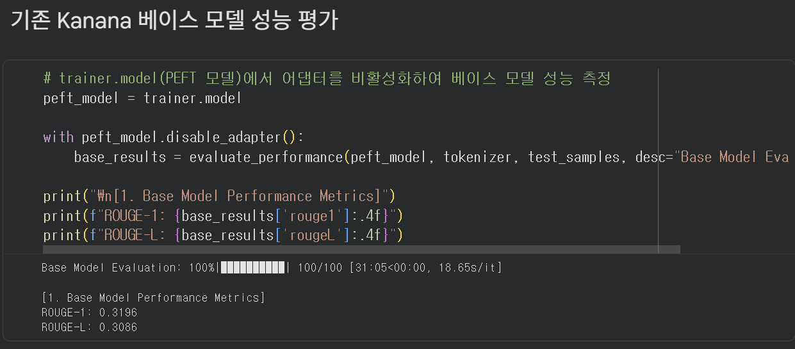
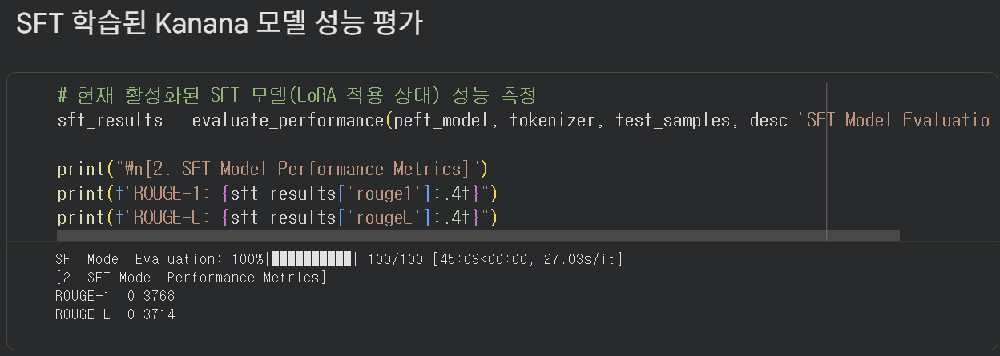
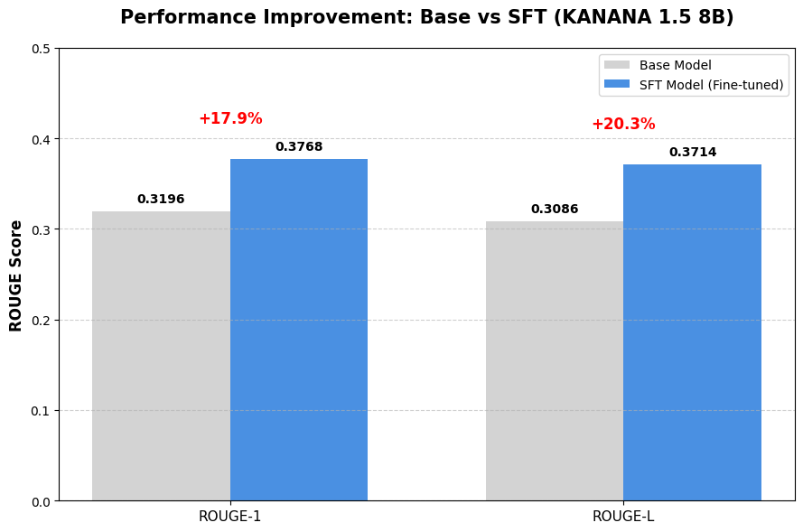

# SFT_Train
**기존 Pre-trained 된 모델(kanana-1.5/8B)에 전처리된 data(SFTlabel.json) 학습시키기**

## 지시어 형식으로 텍스트 구성
```
text = f"### 질문: {question}\n\n### 답변: {answer}"
```
## 모델 및 토크나이저 로드 (A100 최적화)
```
bnb_config = BitsAndBytesConfig(
    load_in_4bit=True,
    bnb_4bit_quant_type="nf4",
    bnb_4bit_compute_dtype=torch.bfloat16 # A100 전용 bf16 연산
)
```
```
tokenizer = AutoTokenizer.from_pretrained(MODEL_ID)
if tokenizer.pad_token is None:
    tokenizer.pad_token = tokenizer.eos_token
tokenizer.padding_side = "right"
```
```
model = AutoModelForCausalLM.from_pretrained(
    MODEL_ID,
    quantization_config=bnb_config,
    device_map="auto",
    trust_remote_code=True,
    attn_implementation="flash_attention_2" # A100 필수 가속 옵션
)
```

## LoRA 설정 (Rank 64 유지)
```
peft_config = LoraConfig(
    r=64,
    lora_alpha=128,
    lora_dropout=0.05,
    bias="none",
    task_type="CAUSAL_LM",
    target_modules=["q_proj", "k_proj", "v_proj", "o_proj", "gate_proj", "up_proj", "down_proj"]
)
```

### LoRA 설정 코드 파라미터 상세 분석
1. **r = 64**:
    - 원래 모델의 거대한 행렬($d \times d$)을 두 개의 아주 작은 행렬($d \times r, r \times d$)로 쪼개어 학습.

    - **Small (r=4~16)**: 모델의 말투를 바꾸거나 간단한 형식을 맞추는 ‘스타일 전이’에 주로 쓰임. 파라미터가 매우 적어 가벼움.
    - **Large (r=32 ~ 64)**: 모델에 새로운 전문 지식이나 복잡한 논리를 가르칠 때 사용.
*NIA097* 데이터셋은 도메인의 전문적인 지식을 담고 있으므로 r=64 결정.(A100 GPU 사용)

2. **lora_alpha = 128**:
    - 학습된 가중치를 원래 모델에 반영할 때 얼마나 강하게 반영할지 결정하는 스케일링 계수.
    - 보통 r 값의 2배 정도로 설정하여 학습의 안정성을 높임.

3. **lora_dropout = 0.05**:
    - 학습 시 무작위로 일부 노드를 꺼서 모델이 특정 데이터에만 과하게 매몰되는 과적합(Overfitting)을 방지.

4. **bias = "none"**:
    - 편향(bias) 파라미터를 학습하지 않겠다는 설정. 파라미터 수를 최소화하여 효율을 높임.

5. **target_modules = [...]**:
    - LoRA를 적용할 모델 내의 구체적인 부위들.
    - Attention(q, k, v, o)뿐만 아니라 MLP 레이어(gate, up, down)까지 설정 → 모델의 전체적인 지식을 깊게 수정.

## 학습 설정 (A100 및 에러 방지 최적화)
```
# 4. 학습 설정 (A100 및 에러 방지 최적화)
training_args = SFTConfig(
    output_dir=OUTPUT_DIR,
    num_train_epochs=1,
    per_device_train_batch_size=4,      # OOM 방지
    gradient_accumulation_steps=8,     # 실제 배치는 32 효과
    learning_rate=2e-4,
    bf16=True,                         # A100 가속
    logging_steps=10,
    save_strategy="epoch",
    gradient_checkpointing=True,       # 메모리 절약
    gradient_checkpointing_kwargs={"use_reentrant": False}, # CheckpointError 해결
```

1. **per_device_train_batch_size=4**:
    - GPU가 한 번에 계산하는 데이터의 개수
    - 8은 OOM 발생

2. **gradient_accumulation_steps=8**:
    - ‘그래디언트 누적’ 기법. 배치 사이즈 4로 8번 계산을 반복한 뒤, 그 결과를 모아서($4 \times 8 = 32$) 한 번에 가중치를 업데이트한다.
    - 실제로는 배치 사이즈 32로 학습하는 안정적인 효과를 얻으면서도 메모리 점유율은 낮게 유지.

3. **bf16=True**:
    - A100 GPU의 강점을 활용하는 설정.
    - 기존의 $fp16$보다 표현 범위가 넓은 $bfloat16$ 형식을 사용하여 학습 도중 숫자가 너무 커지거나 작아져 발생하는 Exploding / Vanishing Gradients을 방지하고 속도를 높임.

4. **save_strategy= “epoch”**:
    - 매 에포크가 끝날 때마다 모델 상태를 저장.

5. **gradient_checkpointing = True**:
    - 연산 과정의 중간 값들을 다 저장하지 않고 필요할 때 다시 계산하는 방식.
    - 계산량은 조금 늘어나지만 메모리 사용량을 획기적으로 줄여주어 <u>8B 모델 학습 시 필수적인 설정.</u>

6. **gradient_checkpointing_kwargs = {”use_reentrant”: False}** : 최신 PyTorch 환경에서 체크포인트 저장시 발생하는 텐서 불일치 문제를 방어.

## 인자 에러를 피하기 위한 토크나이저 객체에 직접 길이를 입력
```
tokenizer.model_max_length = 1024
```

## 표준 학습 설정
```
# 3. 표준 학습 설정 (SFTConfig 대신 안정적인 TrainingArguments 사용)
# SFTConfig에서 에러가 났던 인자들을 모두 제거한 표준 설정입니다.
training_args = TrainingArguments(
    output_dir=OUTPUT_DIR,
    num_train_epochs=1,
    per_device_train_batch_size=4,      # OOM 방지
    gradient_accumulation_steps=8,     # 실제 배치 사이즈 32 효과
    learning_rate=2e-4,
    bf16=True,                         # A100 가속 활용
    logging_steps=10,
    save_strategy="epoch",
    gradient_checkpointing=True,       # 메모리 절약
    gradient_checkpointing_kwargs={"use_reentrant": False}, # CheckpointError 방지
    report_to="none"
)
```

**per_device_train_batch_size = 4**: 
    - GPU 한 장당 한 번의 스텝(Step)에서 처리할 데이터 개수. 8B 모델은 크기가 크기 떄문에 OOM 방지를 위해 4 설정.

**gradient_checkpointing = True** :
    - 역전파 시 필요한 중간 연산결과들을 모두 저장하지 않고 필요할 때 다시 계산하여 VRAM 메모리 점유율을 획기적으로 낮춤.

**report_to = “none”** : 
    - 학습 로그를 Weights & Biases(wandb)와 같은 외부 대시보드에 전송하지 않고 로컬 환경에서만 확인하도록 설정.

# 실험 결과


